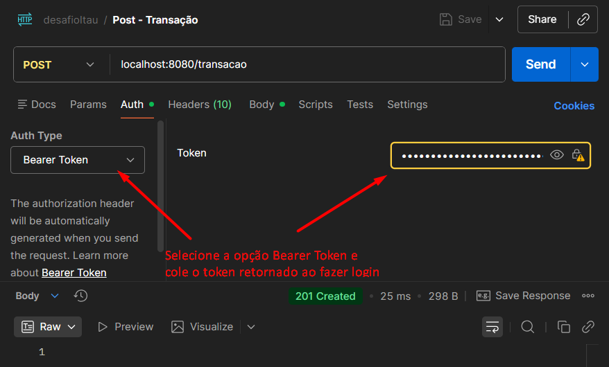
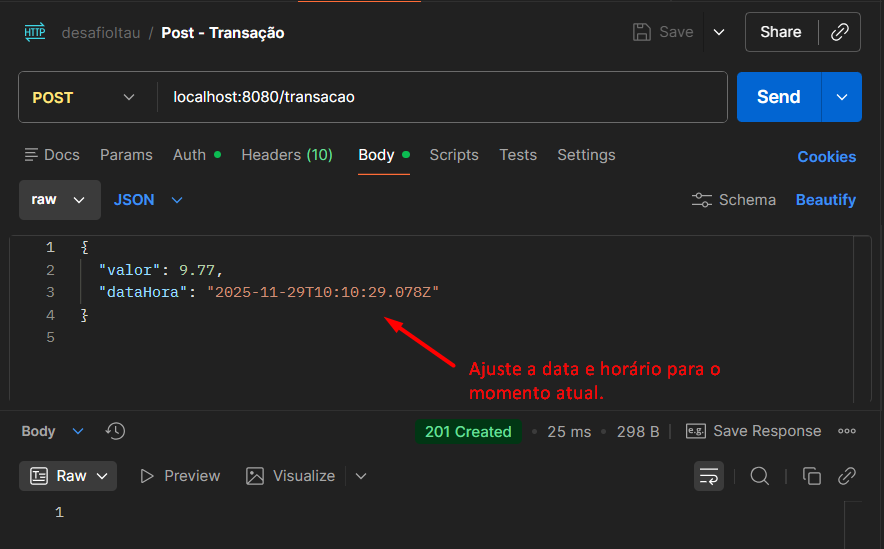
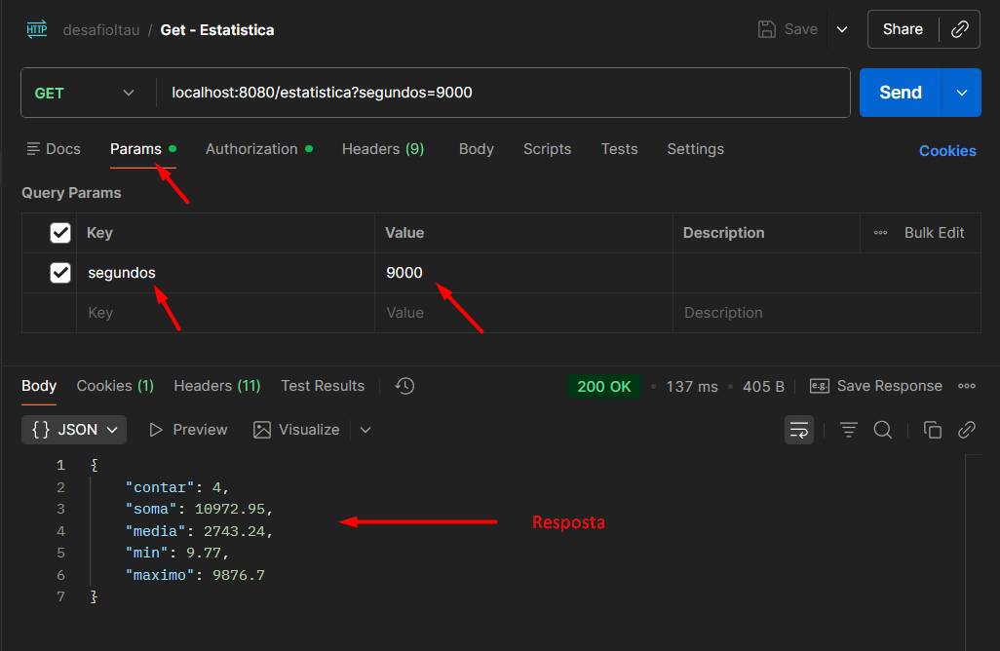
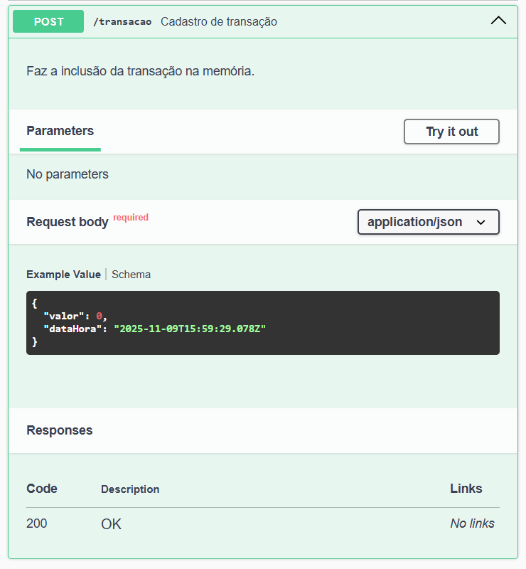

# Desafio Itaú - API de Estatísticas de Transações


Este projeto implementa uma API RESTful em Java com Spring Boot 3 para gerenciar transações e calcular estatísticas em tempo real, focando em transações que ocorreram nos últimos **60 segundos** (ou um intervalo personalizado).

## 🚀 Tecnologias e Ferramentas

O projeto foi desenvolvido com as seguintes tecnologias:

* **Java 17**
* **Spring Boot 3.3.4**
* **Maven**
* **Spring JWT**: Para garantir a segurança da API. 
* **Spring Boot Starter Web**: Para construir a API RESTful.
* **Spring Boot Starter Test**: Para testes unitários e de integração.
* **Spring Boot Starter Actuator**: Para monitoramento (endpoints `health`, `info`).
* **Springdoc OpenAPI UI**: Para documentação Swagger/OpenAPI.
* **Programação Funcional (Streams)**: Utilizada para cálculo eficiente de estatísticas em memória.
* **Records (Java 17)**: Utilizados para os DTOs (`TransacaoDto`, `EstatisticaDto`).

## 📂 Estrutura do Projeto

A organização segue o padrão do Spring Boot e está estruturada por camadas:


## 🛠️ Requisitos de Execução

Para rodar este projeto localmente, você precisará ter instalado:

* **JDK 17** ou superior.
* **Maven** 3.x.

## ⚙️ Como Executar

### 1. Clonar o Repositório

```bash
git clone https://github.com/WTDIAS/desafio_itau.git
```

### 2. Construir e Rodar a Aplicação. Use o Maven para construir e executar a aplicação:

```bash
# Compila e empacota a aplicação
mvn clean package

# Executa o JAR gerado (ajuste o nome do arquivo, se necessário)
java -jar target/desafioItau-0.0.1-SNAPSHOT.jar
```
A aplicação será iniciada na porta padrão do Spring Boot (geralmente 8080).

## 🧪 Como utilizar
* **1** - Com o Postman instalado.
* **2** - Para fazer as requisições é necessário fazer login através de uma requisição POST contendo o JSON. Será retornado um JSON contendo o token que será necessário para demais requisições.<br>
  {<br>
  "username":"admin",<br>
  "password":"1234"<br>
  }
* 
* **3** - Para inserir uma transação, você deverá inserir o token adquirido durante o login na aba auth conforme a imagem abaixo.

* **4** - Em seguida na aba Body, informe o JSON com valor e datahora conforme a imagem abaixo.<br>
{<br>
  "valor": 9.77,<br>
  "dataHora": "2025-11-29T10:10:29.078Z"<br>
}

* 
* **5** - Para coletar a estatística, também será necessário inserir o token na aba auth. Você pode opcionalmente modificar o intervalo para cálculo da estatística, pois o intervalo default é de 60s.

* **6** - Enjoy 😉
## 🗺️ Endpoints da API
A documentação completa da API (Swagger UI) estará disponível em http://localhost:8080/swagger-ui.html após a inicialização do servidor.





## 📝 Nota  
A API utiliza a classe FormatadorNumerico para garantir que os valores de soma e media sejam formatados com exatamente duas casas decimais, usando o arredondamento HALF_UP.


## 💉 Teste de saúde da API
### Para verificação da saúde da API acesse:  
http://localhost:8080/actuator/health

## 🧪 Testes  
Os testes unitários garantem a cobertura das regras de negócio e o correto funcionamento dos controllers.  

Para executar todos os testes:  
```bash
  mvn test
```
### Principais Casos de Teste Cobertos:  

* Adição de transação válida/inválida (nula, negativa, futura).  
* Cálculo de estatísticas para lista vazia, intervalo sem transações, e intervalo com transações válidas.  
* TransacaoController,Retorno de status HTTP 201 para sucesso (POST /transacao).  
* Retorno de status HTTP 422 e 400 para falhas de validação e JSON inválido.  
* Retorno de status HTTP 200 e corpo EstatisticaDto para requisição GET /estatistica (padrão e personalizado).  
* FormatadorNumerico,"Arredondamento para cima e para baixo, manutenção de 2 casas decimais, e tratamento de valor null.  
